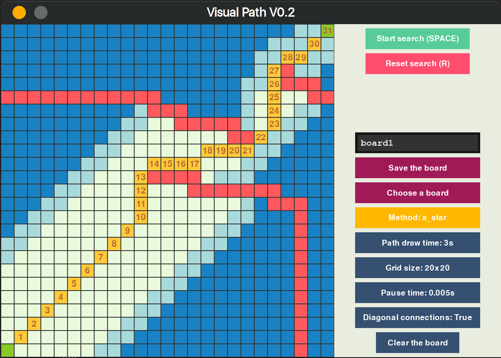

# Visual Path
A little python project to visualize path finding algorithms. 



# How to use
* ```
  pip install pygame
* ```python 
  python path.py
* Place **EXACTLY 2 GREEN** blocks with **RMB** and click **START SEARCH**
  * You can **place** blocks to block the path with **LMB**
  * You can **delete** blocks with **MIDDLE CLICK**

# Implemented algoritms
 - [X] BFS
 - [ ] Dijkstra
 - [ ] Greedy
 - [ ] A*(A star)

# Button controls
* LMB - Increment
* RMB - Decrement
* MIDDLE CLICK - Set to 0

# Tweaking
All of the default variables are in **variables.json**
* Pause time - controls time between new blocks get visited
* Path draw time - controls total time to draw the path
* Grid size - controls the size of the grid in each dimension
* Diagonal connections - controls whether algorithms will choose diagonal path